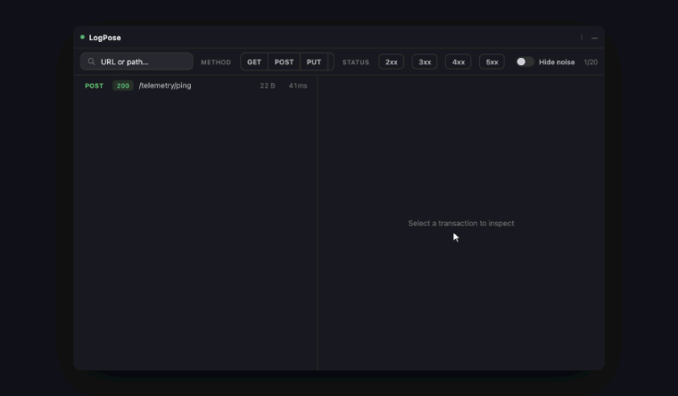
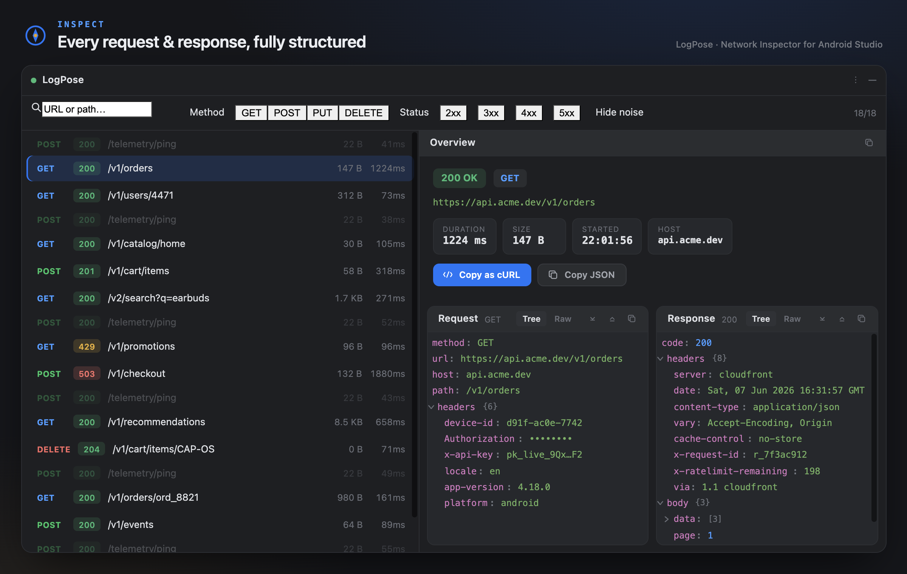
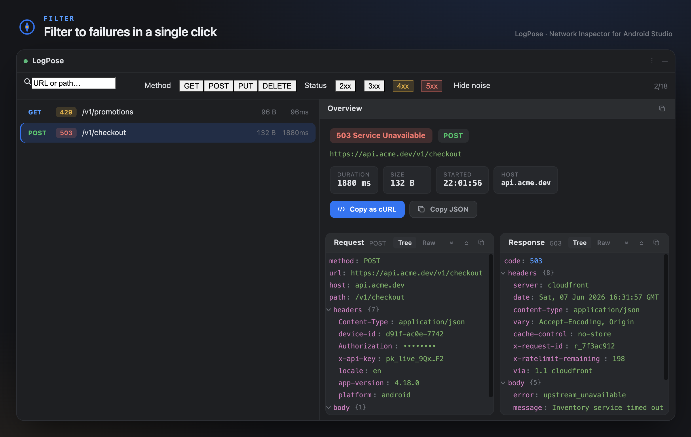
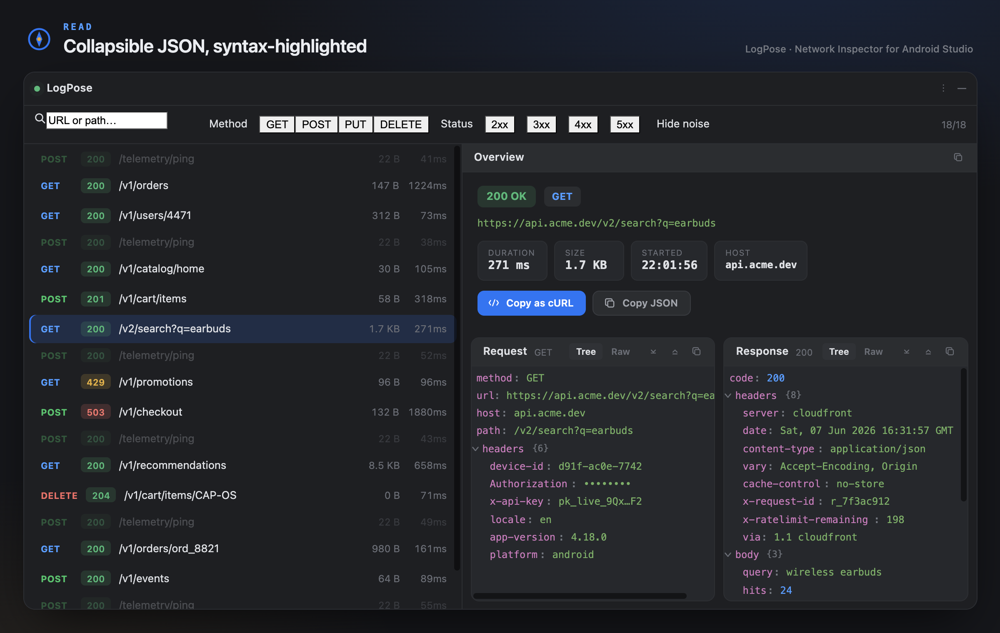
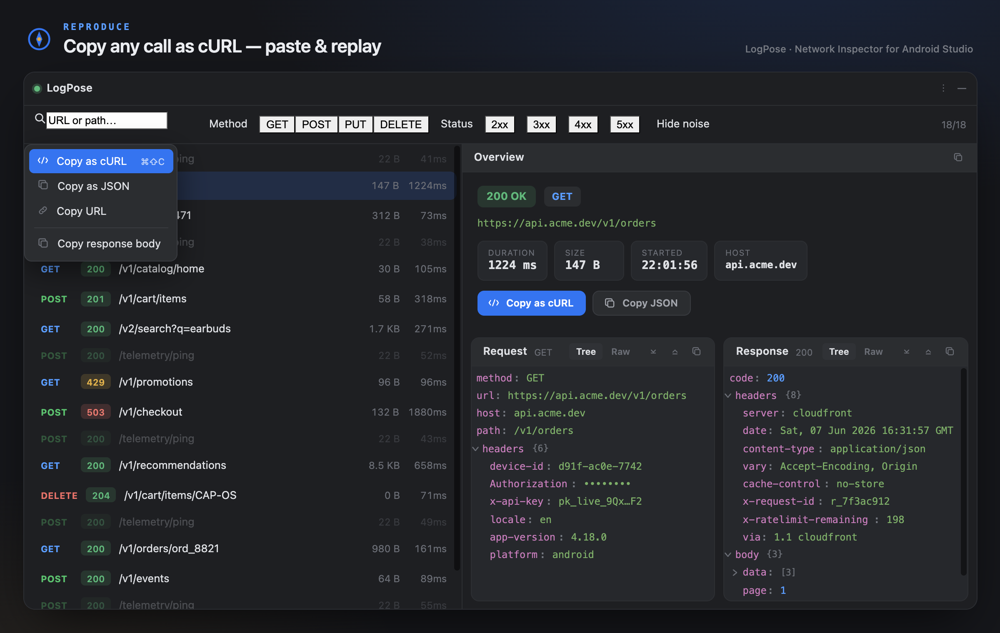
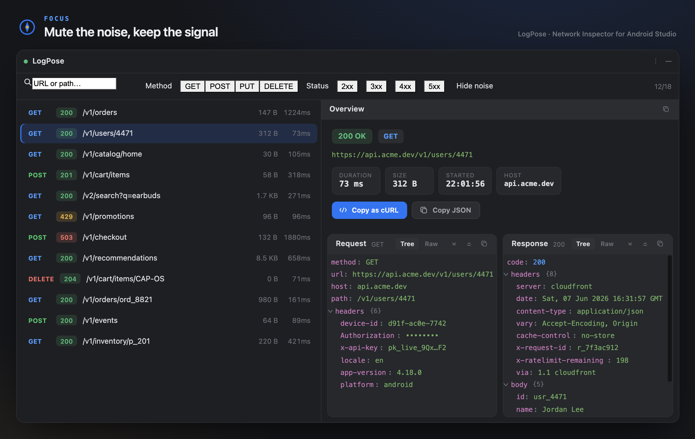

# LogPose 🧭

> A lightweight Android Studio / IntelliJ plugin for reading your app's network traffic — without the logcat pain.

[](https://github.com/siddharthjaswal/logpose/actions/workflows/ci.yml)
[](https://github.com/siddharthjaswal/logpose/releases)
[](LICENSE)

LogPose is named after the navigational device from *One Piece* that reads an island's
"log" to point you the right way. This one reads your **logcat** and points you straight
at the HTTP request you care about.

---

## Demo



## Screenshots











---

## Features

- **Modern "Studio" tool window** — a master/detail view with color-coded method/status
  pill badges, a hero **Overview** card (status, URL, duration/size/started/host/id stat
  chips), and side-by-side **Request** / **Response** cards.
- **Collapsible JSON trees** — request/response bodies are parsed back into navigable,
  syntax-colored trees; bodies that are JSON nest directly under `body`. Toggle **Tree /
  Raw** (raw is syntax-highlighted too).
- **Find in body** — `⌘F` / `Ctrl+F` inside either card highlights all matches with
  next/prev navigation and an `n/total` counter.
- **One-click filter bar** — a compact URL search box plus Method (GET/POST/PUT/DELETE)
  and Status (2xx–5xx) toggles, and a **Hide noise** switch. No typing required.
- **Mute noisy endpoints** — right-click → mute; muted calls stay visible but fade into
  the background (numeric path segments are normalized, so one mute covers all ids).
  Persists across restarts.
- **Copy everything** — Copy as **cURL** (hover a row or right-click), Copy as **JSON**
  (per-section or the whole transaction), Copy URL, Copy response body.
- **First-class multipart uploads** — S3/GCS media uploads show per-part metadata, never
  raw bytes.
- **Atomic, ordered capture** — no interleaved or mismatched bodies, even under load;
  oversized payloads are chunked and reassembled.

## Why?

The usual setup — OkHttp's `HttpLoggingInterceptor` at `BODY` level dumped into logcat —
breaks down fast:

- **Bodies get mismatched.** `HttpLoggingInterceptor` emits many separate `Log` lines per
  call. Concurrent requests on different threads interleave, so request/response bodies
  get switched.
- **Too much noise**, mixed in with every other app log.
- **No expand/collapse** — it's a flat text stream.
- **Pretty JSON eats the screen** — it's all-or-nothing.
- **Large bodies get truncated** (logcat caps entries at ~4 KB) and **multipart media
  uploads (S3 / GCS) are unreadable** binary dumps.
- **Hard to filter** to "just the `/orders` calls" or "only 5xx".

The root cause is that **logcat is the wrong layer**. LogPose fixes it by emitting **one
structured transaction per HTTP exchange** and rendering it in a real UI.

## How it works

```
┌─────────────────────────┐                  ┌──────────────────────────────┐
│  Android app             │                  │  Android Studio / IntelliJ   │
│                          │   one JSON line  │  LogPose tool window         │
│  LogPose interceptor     │   per exchange   │  • list of transactions      │
│  builds ONE Transaction  │ ───(logcat)────▶ │  • expand / collapse         │
│  (request + response)    │   tag: LogPose   │  • pretty JSON               │
│                          │                  │  • filter / search           │
└─────────────────────────┘                  └──────────────────────────────┘
```

- The on-device interceptor serializes the **whole** request+response exchange into a
  single JSON object and logs it as **one line** under the `LogPose` tag. Atomic emission
  is what eliminates interleaving and mismatched bodies.
- The plugin runs `adb logcat -v raw -s LogPose:V` (only our tag, raw payloads — no
  noise), parses each line, and renders a filterable master/detail view.
- Payloads bigger than a logcat line are split into ordered **chunks** and reassembled by
  the plugin.
- Multipart uploads ship **per-part metadata** (name, filename, content-type, size) — not
  raw bytes — so media uploads stay readable and cheap.

> The plugin talks to `adb` directly and does **not** depend on the bundled Android
> plugin, so it works in any JetBrains IDE.

## The wire format

The contract between the device and the plugin is a single JSON object per line:

```jsonc
{
  "id": "a1b2c3",                 // correlates request + response
  "startedAtMillis": 1733500000000,
  "durationMillis": 142,
  "request": {
    "method": "POST",
    "url": "https://api.example.com/v1/orders",
    "host": "api.example.com",
    "path": "/v1/orders",
    "headers": { "Content-Type": "application/json" },
    "body": { "contentType": "application/json", "sizeBytes": 57, "text": "{...}" }
  },
  "response": {
    "code": 200,
    "message": "OK",
    "headers": { "Content-Type": "application/json" },
    "body": { "contentType": "application/json", "sizeBytes": 1203, "text": "{...}", "truncated": false }
  }
}
```

Multipart upload body example (no raw bytes):

```jsonc
"body": {
  "contentType": "multipart/form-data",
  "parts": [
    { "name": "file", "filename": "receipt.jpg", "contentType": "image/jpeg", "sizeBytes": 824123 },
    { "name": "meta", "contentType": "application/json", "sizeBytes": 64 }
  ]
}
```

Chunk envelope (for oversized payloads):

```jsonc
{ "id": "a1b2c3", "seq": 0, "total": 3, "payload": "<json-fragment>" }
```

See [`Transaction.kt`](src/main/kotlin/io/github/siddharthjaswal/logpose/model/Transaction.kt)
for the canonical schema.

## Filtering

Filtering is a one-line, zero-typing bar (all conditions AND-ed):

| Control | Effect |
|---|---|
| **Search box** | URL/path contains the text (case-insensitive) |
| **METHOD** GET / POST / PUT / DELETE | multi-select; show only the picked methods |
| **STATUS** 2xx / 3xx / 4xx / 5xx | multi-select; show only the picked status classes |
| **Hide noise** switch | hide muted/noise endpoints entirely (right-click a row → mute to mark it noise) |

## Getting started

LogPose has two halves and you need both: the **IDE plugin** (reads logcat) and a
one-line **OkHttp interceptor** in your app (emits the structured transactions the
plugin reads).

### 1. Install the plugin

**From a release zip** (until it's on the JetBrains Marketplace):

1. Download `logpose-<version>.zip` from [Releases](https://github.com/siddharthjaswal/logpose/releases).
2. Android Studio / IntelliJ → **Settings → Plugins → ⚙️ → Install Plugin from Disk…**
3. Pick the zip and **restart**. A **LogPose** tool window appears at the bottom.

**Or build it yourself:**

```bash
git clone https://github.com/siddharthjaswal/logpose.git
cd logpose
./gradlew buildPlugin   # zip in build/distributions/
# or: ./gradlew runIde  # launch a sandbox IDE with the plugin loaded
```

### 2. Add the interceptor to your app

The interceptor is distributed via [JitPack](https://jitpack.io/#siddharthjaswal/logpose):

```kotlin
// settings.gradle.kts
dependencyResolutionManagement {
    repositories { maven("https://jitpack.io") }
}

// app/build.gradle.kts
dependencies {
    debugImplementation("com.github.siddharthjaswal:logpose:v0.9.8")
}
```

```kotlin
val client = OkHttpClient.Builder()
    // Add LAST so LogPose sees the final request and the decoded response.
    .addInterceptor(LogPoseInterceptor(LogPoseConfig(enabled = BuildConfig.DEBUG)))
    .build()
```

`enabled = BuildConfig.DEBUG` keeps it inert in release. See
[`logpose-android/README.md`](logpose-android/README.md) for config (body-size limits,
header redaction, custom tag, custom transport).

### 3. Capture

1. Open the **LogPose** tool window (bottom edge).
2. Click **▶** to start capturing — it clears the device log buffer and tails new traffic.
3. Run your app on a device/emulator. Transactions stream in live.
4. Filter by method/status/URL, click a row to inspect the JSON, **Copy as cURL**, mute
   noisy endpoints, etc.

> Multiple devices attached? LogPose currently uses the default `adb` device — a picker
> is on the roadmap.

## Repository layout

```
logpose/
├── src/…                 # the IntelliJ / Android Studio plugin (this build)
└── logpose-android/      # the drop-in OkHttp interceptor (separate Gradle build)
```

The two halves talk over the [wire format](#the-wire-format) above — the interceptor
emits it, the plugin reads it. See [`logpose-android/README.md`](logpose-android/README.md)
for the device-side setup.

## What works today

- [x] Plugin: tool window, logcat capture, master/detail, chunk reassembly
- [x] **`logpose-android`** interceptor: atomic transaction, multipart metadata, gzip,
      header redaction, chunking
- [x] Collapsible JSON tree + real JSON editor (folding) in Raw mode
- [x] Copy as cURL / JSON, endpoint muting, one-click filter bar, find-in-body
- [x] Live in-flight requests — appear on hit, ticking timer + loader until the response
- [x] Modern "Studio" card UI, custom icon, light & dark theme

## Road to 1.0 — production checklist

### Distribution

- [x] **Interceptor published** on JitPack — `com.github.siddharthjaswal:logpose:v0.9.8`
      (no `mavenLocal` needed); `jitpack.yml` builds the `logpose-android` subproject.
- [x] **Plugin submitted** to the [JetBrains Marketplace](https://plugins.jetbrains.com/plugin/32148-logpose)
      *(in review)*; signing + publishing wired via GitHub Actions (`RELEASING.md`).
- [ ] Maven Central for the interceptor (optional, more "official" than JitPack).

### Quality & trust

- [x] **CI** (GitHub Actions): `buildPlugin` + `verifyPlugin` on push/PR; GitHub Release on tag.
- [x] **Plugin compatibility** verified (Plugin Verifier vs 2024.1 / 2024.3; `since-build 233`,
      no upper bound; bundled JSON module).
- [x] **`CHANGELOG.md`** + `<change-notes>` in `plugin.xml`; semantic versioning.
- [x] **Security/privacy**: documented — runs on *debug/staging* only, `Authorization` &
      cookies redacted on-device, bodies never leave logcat.
- [ ] **Tests** for the pure logic: `TransactionParser` (incl. chunk reassembly),
      `CurlBuilder` quoting, `FilterState` matching, `MutedEndpoints.normalize`, body
      capture (multipart/binary/gzip/truncation). *(the main remaining item)*

### Polish / nice-to-have

- [ ] Per-device picker when multiple devices/emulators are attached.
- [ ] Settings panel (tag, body limits, default filters) instead of code-only config.
- [ ] Optional socket transport (`adb reverse`) to bypass logcat truncation entirely.
- [ ] Persist/replay captured sessions; export HAR.
- [ ] Zero-setup "raw OkHttp" capture mode (parse stock `HttpLoggingInterceptor` output).

## Contributing

Issues and PRs welcome. This is pre-1.0 — the wire format may still change.

## License

[Apache 2.0](LICENSE)
