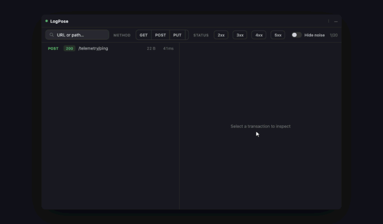
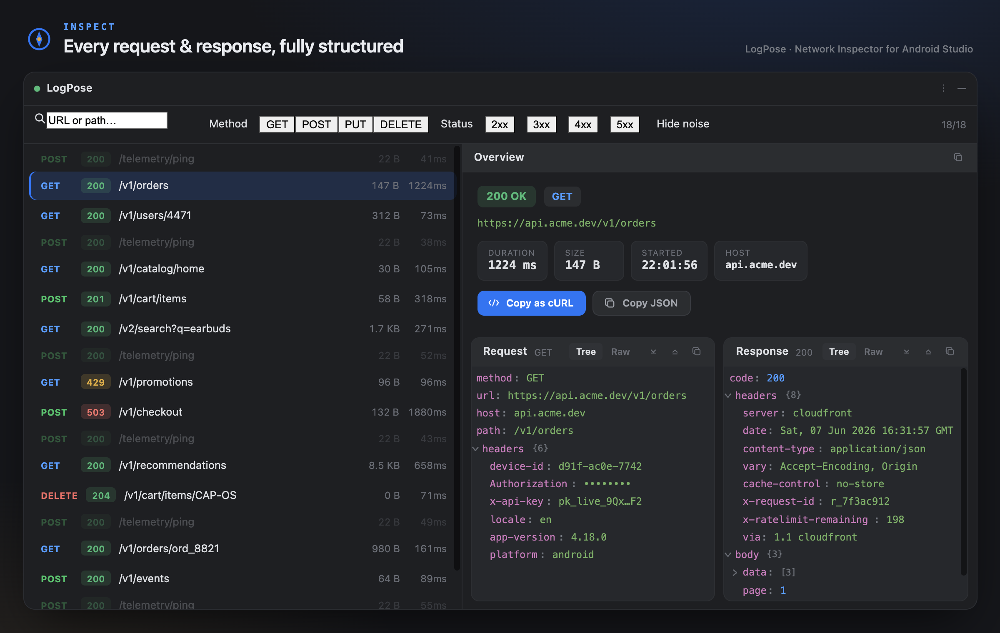
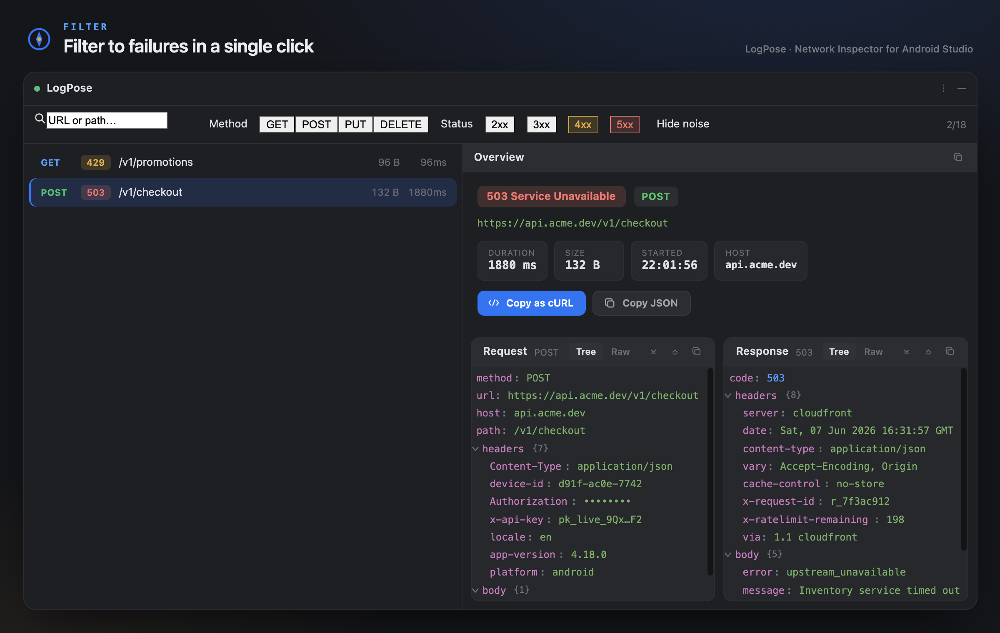
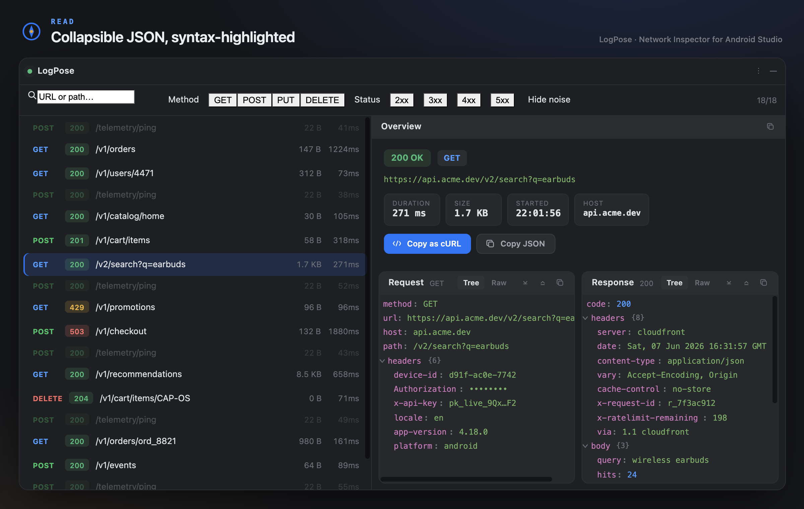
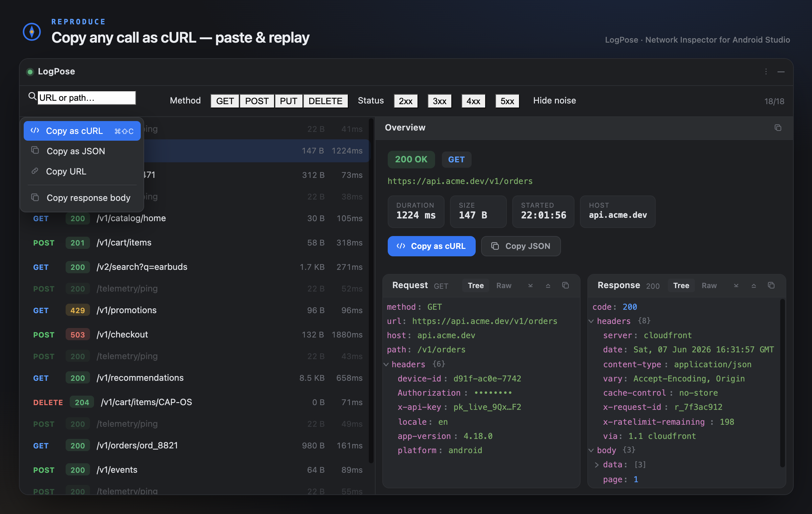
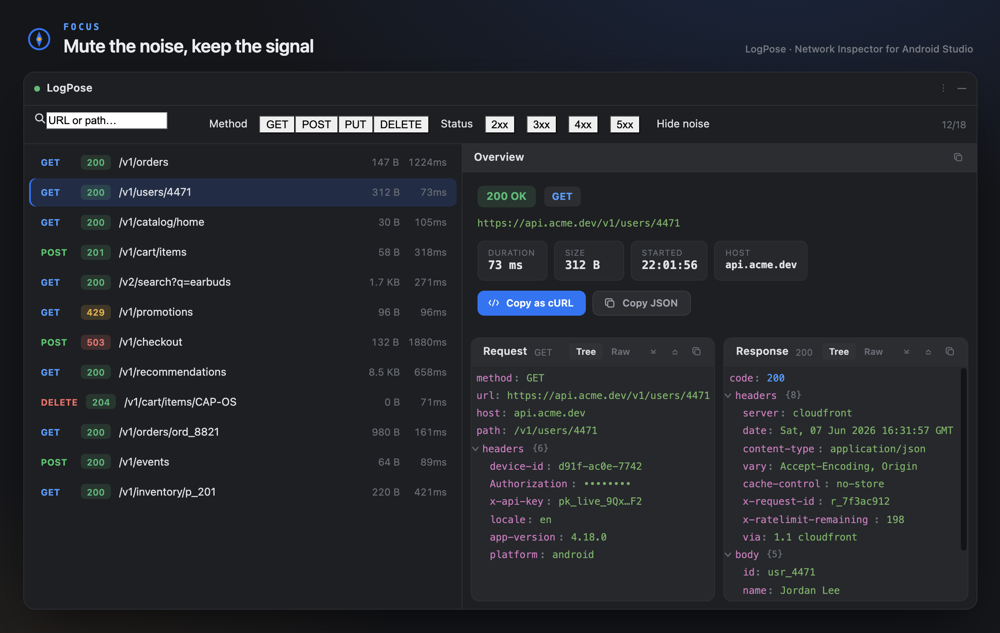

<p align="center">
  
</p>

<h1 align="center">LogPose</h1>

<p align="center">
  <b>Inspect and mock your Android app's network traffic — right inside the IDE.</b><br/>
  No proxy. No certificates. No <code>adb logcat | grep</code>.
</p>

<p align="center">
  <a href="https://github.com/siddharthjaswal/logpose/actions/workflows/ci.yml"></a>
  <a href="https://github.com/siddharthjaswal/logpose/releases"></a>
  <a href="LICENSE"></a>
</p>

LogPose is named after the navigational device from *One Piece* that reads an island's
"log" to point you the right way. This one reads your **logcat** and points you straight at
the request you care about — then lets you **serve a mock back to the device** without
touching backend or app code. HTTP traffic and **FCM pushes** land in one unified timeline.

---

## Demo



## Screenshots











---

## Features

- **Your coding agent can read the running app** — LogPose exposes the live capture over
  **MCP**, so Claude Code (or any MCP client) can answer "what did the app actually request,
  and why did it fail?" from real traffic instead of a pasted log line — and can create a mock
  to reproduce or unblock a state. See [Connect a coding agent](#connect-a-coding-agent).
- **Database, background work and remote config, first class** — Room queries show their
  operation and table, a WorkManager request occupies one row that updates as it runs (and
  badges its retries), and a config activation reports exactly which flags changed, with
  before → after. See [Database, workers and config](#database-workers-and-config).
- **Log anything else too** — `LogPose.event("PaymentSheet") { … }` puts any other subsystem on
  the same timeline. Events carry their own presentation, so they render with no plugin
  changes. See [Log your own events](#log-your-own-events).
- **Mock & replay** — right-click any captured request → **Mock this endpoint** and serve a
  response instead of hitting the network. **Replace** the whole body, or **merge** your JSON
  into the real response to override a single field and leave the rest backend-generated.
  Edit the response **field by field** (fold, tick what to override, see the original beside
  your change), inject latency / timeouts / connection failures, cap serves, match paths with
  `*`, narrow by query/header/body, and serve **a different response per hit**. Rules sync over
  adb, show hit counts, and clear when capture stops.
- **Start the flow, don't just watch it** — LogPose can deliver a synthetic **FCM push** into the
  running app, in-process, with no Play services and no network. Re-send a captured push or
  compose a new one; injected rows are marked **INJ** so the timeline never passes one off as
  real. See [Push injection & replay](#push-injection--replay).
- **Scenarios** — bottle the current mocks, or a whole recorded session, into a committable
  `.logpose/scenarios/<name>.json` and load it to put the app in a known state offline. Sharing a
  repro becomes committing a file. See [Scenarios](#scenarios).
- **Trace waterfall** — read a whole flow on one time axis: what the push set off, what
  overlapped, what's still running, what took longest. See [Trace waterfall](#trace-waterfall).
- **Correlation keys** — group a flow by the id a human actually knows — `order_id 21053953` —
  instead of a trace the app may never have propagated. Tell LogPose your keys once and the row
  menu, a hover glyph, the waterfall and the MCP tools all speak in them; paste an id from a
  ticket with **Find by value…**. See [Correlate a flow](#correlate-a-flow).
- **FCM in the same timeline** — Firebase pushes and token refreshes appear inline with HTTP
  traffic, so you can read push → API call → UI as one story. Notification, metadata and data
  payload are all inspectable.
- **Modern "Studio" tool window** — a master/detail view with color-coded method/status
  pill badges, a hero **Overview** card (status, URL, duration/size/started/host/id stat
  chips), and side-by-side **Request** / **Response** cards.
- **Duplicate detection** — repeated calls in a burst get a `DUP ×N` tag; overlapping
  non-idempotent calls (likely double-submits) are flagged in red.
- **Copy the timeline** — multi-select rows (`⇧↑/↓`) and copy the call sequence as plain
  text, ideal for pasting into a bug report.
- **Collapsible JSON trees** — request/response bodies are parsed back into navigable,
  syntax-colored trees; bodies that are JSON nest directly under `body`. Toggle **Tree /
  Raw** (raw is syntax-highlighted too).
- **Find in body** — `⌘F` / `Ctrl+F` inside either card highlights all matches with
  next/prev navigation and an `n/total` counter.
- **One-click filter bar** — a compact URL search box plus Method (GET/POST/PUT/DELETE)
  and Status (2xx–5xx) toggles, and a **Hide noise** switch. No typing required.
- **Mute noisy endpoints** — right-click → mute; muted calls stay visible but fade into
  the background (numeric path segments are normalized, so one mute covers all ids).
  Persists across restarts.
- **Copy everything** — Copy as **cURL** (hover a row or right-click), Copy as **JSON**
  (per-section or the whole transaction), Copy URL, Copy response body.
- **First-class multipart uploads** — S3/GCS media uploads show per-part metadata, never
  raw bytes.
- **Atomic, ordered capture** — no interleaved or mismatched bodies, even under load;
  oversized payloads are chunked and reassembled.

## Why?

The usual setup — OkHttp's `HttpLoggingInterceptor` at `BODY` level dumped into logcat —
breaks down fast:

- **Bodies get mismatched.** `HttpLoggingInterceptor` emits many separate `Log` lines per
  call. Concurrent requests on different threads interleave, so request/response bodies
  get switched.
- **Too much noise**, mixed in with every other app log.
- **No expand/collapse** — it's a flat text stream.
- **Pretty JSON eats the screen** — it's all-or-nothing.
- **Large bodies get truncated** (logcat caps entries at ~4 KB) and **multipart media
  uploads (S3 / GCS) are unreadable** binary dumps.
- **Hard to filter** to "just the `/orders` calls" or "only 5xx".

The root cause is that **logcat is the wrong layer**. LogPose fixes it by emitting **one
structured transaction per HTTP exchange** and rendering it in a real UI.

## How it works

```
┌─────────────────────────┐                  ┌──────────────────────────────┐
│  Android app             │                  │  Android Studio / IntelliJ   │
│                          │   one JSON line  │  LogPose tool window         │
│  LogPose interceptor     │   per exchange   │  • list of transactions      │
│  builds ONE Transaction  │ ───(logcat)────▶ │  • expand / collapse         │
│  (request + response)    │   tag: LogPose   │  • pretty JSON               │
│                          │                  │  • filter / search           │
└─────────────────────────┘                  └──────────────────────────────┘
```

- The on-device interceptor serializes the **whole** request+response exchange into a
  single JSON object and logs it as **one line** under the `LogPose` tag. Atomic emission
  is what eliminates interleaving and mismatched bodies.
- The plugin runs `adb logcat -v raw -s LogPose:V` (only our tag, raw payloads — no
  noise), parses each line, and renders a filterable master/detail view.
- Payloads bigger than a logcat line are split into ordered **chunks** and reassembled by
  the plugin.
- Multipart uploads ship **per-part metadata** (name, filename, content-type, size) — not
  raw bytes — so media uploads stay readable and cheap.

> The plugin talks to `adb` directly and does **not** depend on the bundled Android
> plugin, so it works in any JetBrains IDE.

## The wire format

The contract between the device and the plugin is a single JSON object per line: an
**envelope** carrying an opaque payload. The plugin only needs the envelope to place a row on
the timeline, which is what lets an app emit a `kind` the plugin has never heard of.

```jsonc
{
  "v": 1,
  "kind": "http",                 // "http" | "fcm" | "event" | anything you define
  "id": "a1b2c3",                 // correlates request + response; re-emit to update in place
  "at": 1733500000000,            // span start (device epoch millis)
  "endedAt": 1733500000142,       // null = still open · == at = point in time · > at = a span
  "traceId": "f00d",              // optional, groups related events
  "parentId": null,
  "payload": { /* kind-specific, see below */ }
}
```

An `http` payload — the same shape LogPose has always emitted, now nested under `payload`:

```jsonc
{
  "id": "a1b2c3",
  "startedAtMillis": 1733500000000,
  "durationMillis": 142,
  "request": {
    "method": "POST",
    "url": "https://api.example.com/v1/orders",
    "host": "api.example.com",
    "path": "/v1/orders",
    "headers": { "Content-Type": "application/json" },
    "body": { "contentType": "application/json", "sizeBytes": 57, "text": "{...}" }
  },
  "response": {
    "code": 200,
    "message": "OK",
    "headers": { "Content-Type": "application/json" },
    "body": { "contentType": "application/json", "sizeBytes": 1203, "text": "{...}", "truncated": false }
  }
}
```

Multipart upload body example (no raw bytes):

```jsonc
"body": {
  "contentType": "multipart/form-data",
  "parts": [
    { "name": "file", "filename": "receipt.jpg", "contentType": "image/jpeg", "sizeBytes": 824123 },
    { "name": "meta", "contentType": "application/json", "sizeBytes": 64 }
  ]
}
```

An `event` payload — a self-describing app event, rendered without any plugin support:

```jsonc
{
  "title": "UserDao.insert",
  "subtitle": "users (3 rows)",
  "badges":   [ { "text": "DB", "tone": "info" } ],       // tones, never colors
  "sections": [ { "label": "SQL", "type": "code", "body": "INSERT INTO users …" } ]
}
```

Chunk envelope (for oversized payloads — unchanged, and wraps any of the above):

```jsonc
{ "id": "a1b2c3", "seq": 0, "total": 3, "payload": "<json-fragment>" }
```

Reverse-channel control messages (`hello`, `mock_ack`, `push_ack`) are deliberately **not**
enveloped: they're a separate IDE ↔ device protocol, not timeline rows. Commands travel the other
way as `adb shell am broadcast` to a `DUMP`-gated receiver — a rule set (`cmd=rules`) or a
synthetic push (`cmd=push`).

Bodies stay opaque to the transport, and presentation stays semantic — a badge carries a tone
and a section carries a type, never a color or a layout, so a theme change can never become a
wire break.

See [`Transaction.kt`](src/main/kotlin/io/github/siddharthjaswal/logpose/model/Transaction.kt)
for the canonical schema. Plugin 1.6.0 still reads the pre-envelope format emitted by
`logpose-android` ≤ 1.2.1, so an old library keeps working while you upgrade. The reverse is
**not** true: library 1.4.0 needs plugin 1.5.0+.

## Filtering

Filtering is a one-line, zero-typing bar (all conditions AND-ed):

| Control | Effect |
|---|---|
| **Search box** | URL/path contains the text (case-insensitive); also matches event titles, kinds and trace ids |
| **TYPE** NET / FCM / DB / WORK / CONF / APP | multi-select; show only the picked kinds of event |
| **METHOD** GET / POST / PUT / DELETE | multi-select; show only the picked methods |
| **STATUS** 2xx / 3xx / 4xx / 5xx | multi-select; show only the picked status classes |
| **Hide noise** switch | hide muted/noise endpoints entirely (right-click a row → mute to mark it noise) |
| **`order_id 21053953 ✕`** chip | shown while the timeline is narrowed to a [correlation key](#correlate-a-flow); click it to remove |
| **⋯** overflow | **Find by value…** and **Correlation keys…** — the two actions that need the whole capture, not a row |

## Getting started

LogPose has two halves **and you need both** — they ship through different channels and
version independently:

| Half | What it does | Where it comes from | Version |
|---|---|---|---|
| **IDE plugin** | reads logcat, renders the timeline | JetBrains Marketplace | 1.9.0 |
| **`logpose-android`** | emits structured events from your app | JitPack (Gradle dependency) | `v1.7.1` |

Install the plugin but not the library and the timeline stays empty — there's nothing being
emitted for it to read. **Keep the plugin at or ahead of the library:** library `v1.7.1` needs
plugin 1.5.0+ to render at all (1.8.0 for push injection and the new mock matchers), and on an
older plugin rows are dropped silently, with no error saying why. Correlation keys are a plugin
feature only — they read the payloads your app already emits, so any library version works.

### 1. Install the plugin

**From the JetBrains Marketplace** — Android Studio / IntelliJ → **Settings → Plugins →
Marketplace**, search **LogPose**, **Install**, restart. A **LogPose** tool window appears at
the bottom. ([Plugin page](https://plugins.jetbrains.com/plugin/32148-logpose))

**Or from a release zip:**

1. Download `logpose-<version>.zip` from [Releases](https://github.com/siddharthjaswal/logpose/releases).
2. **Settings → Plugins → ⚙️ → Install Plugin from Disk…**
3. Pick the zip and **restart**.

**Or build it yourself:**

```bash
git clone https://github.com/siddharthjaswal/logpose.git
cd logpose
./gradlew buildPlugin   # zip in build/distributions/
# or: ./gradlew runIde  # launch a sandbox IDE with the plugin loaded
```

### 2. Add the interceptor to your app

The interceptor is distributed via [JitPack](https://jitpack.io/#siddharthjaswal/logpose).
**Library `v1.7.1` needs plugin 1.5.0+** (1.6.0+ for db/worker/config rows, 1.8.0 for push
injection, scenarios and the new mock matchers, 1.9.0 to pair with this version's injected-row
collapse) — on an older plugin the timeline stays empty with no error explaining why:

```kotlin
// settings.gradle.kts
dependencyResolutionManagement {
    repositories { maven("https://jitpack.io") }
}

// app/build.gradle.kts
dependencies {
    // Debug builds: the real interceptor.
    debugImplementation("com.github.siddharthjaswal.logpose:logpose-android:v1.7.1")
    // Release builds: a zero-overhead no-op with the SAME api — keeps LogPose out of
    // production entirely (no logcat output, no kotlinx-serialization, zero transitive deps).
    releaseImplementation("com.github.siddharthjaswal.logpose:logpose-no-op:v1.7.1")
}
```

> **Use the split consistently, and never pull both jars into one classpath.** The real and no-op
> artifacts deliberately share class names (that's what lets your call sites compile unchanged), so
> two artifacts on one variant's classpath is a duplicate-class build error. That happens if you
> (a) reference a repo-level **aggregator** coordinate (`com.github.siddharthjaswal:logpose`), which
> drags in *both* modules, or (b) put **one module on the split and another on plain
> `implementation`** — the plain one adds the real jar to the release classpath alongside the no-op.
> Fix: use the `debug`/`release` split (or all-variants `implementation`, below) — the *same choice*
> in **every** module that touches LogPose, and address the two `logpose-android` / `logpose-no-op`
> modules directly rather than the aggregator.

```kotlin
val client = OkHttpClient.Builder()
    // Add LAST so LogPose sees the final request and the decoded response.
    // Compiles unchanged in both variants — the no-op exposes the same LogPoseInterceptor.
    .addInterceptor(LogPoseInterceptor(LogPoseConfig(enabled = BuildConfig.DEBUG)))
    .build()
```

With the `debug`/`release` split above, the release build links against the no-op stub, so
LogPose is gone from production by construction. `enabled = BuildConfig.DEBUG` is then just
belt-and-suspenders. (Prefer a single artifact in all variants? Use plain
`implementation("…:logpose-android:v1.7.1")` everywhere and rely on the `enabled` flag — but then
the real artifact, including its auto-init provider and DUMP-gated receivers, ships in release too.)
See
[`logpose-android/README.md`](logpose-android/README.md) for config (body-size limits,
header redaction, custom tag, custom transport).

### 2b. (Optional) See FCM push messages too

LogPose can show Firebase Cloud Messaging pushes and token refreshes inline in the same
timeline as your HTTP traffic. Since a push isn't OkHttp traffic, you hand each one to
LogPose from your `FirebaseMessagingService`. LogPose stays Firebase-free — you copy the
fields you care about into a plain `FcmMessageInfo` (the no-op exposes the same API, so this
compiles and disappears in release):

```kotlin
class MyMessagingService : FirebaseMessagingService() {
    override fun onMessageReceived(m: RemoteMessage) {
        LogPose.logFcmMessage(
            FcmMessageInfo(
                messageId = m.messageId,
                from = m.from,
                collapseKey = m.collapseKey,
                sentTimeMillis = m.sentTime,
                ttlSeconds = m.ttl,
                priority = m.priority,
                notificationTitle = m.notification?.title,
                notificationBody = m.notification?.body,
                data = m.data,
            ),
            LogPoseConfig(enabled = BuildConfig.DEBUG),
        )
        super.onMessageReceived(m)
    }

    override fun onNewToken(token: String) {
        LogPose.logFcmToken(token, LogPoseConfig(enabled = BuildConfig.DEBUG))
    }
}
```

FCM rows show up with an `FCM` tag and a `NOTIF` / `DATA` / `TOKEN` badge; selecting one
opens the notification, metadata (from, priority, ttl, collapse key), and the data payload
as a JSON tree. Use the **TYPE** filter to narrow the stream to `FCM` alone.

### 3. Capture

1. Open the **LogPose** tool window (bottom edge).
2. Click **▶** to start capturing — it clears the device log buffer and tails new traffic.
3. Run your app on a device/emulator. Transactions stream in live.
4. Filter by method/status/URL, click a row to inspect the JSON, **Copy as cURL**, mute
   noisy endpoints, etc.

> Multiple devices attached? LogPose currently uses the default `adb` device — a picker
> is on the roadmap.

## Mock & replay

LogPose can serve responses back to the app instead of hitting the network — reproduce a
state-dependent bug, test an error/empty UI, or inject latency and failures, all without
touching backend or app code.

1. Right-click any captured request → **"Mock this endpoint…"**.
2. Edit the status, body, headers; optionally add latency, cap the number of serves, or set
   the behavior to **timeout** / **connection failure**. The path pattern accepts `*`
   wildcards (e.g. `/app/v4/*/order/*`).
   - **Replace** mode serves your body as the whole response.
   - **Merge** mode keeps the real backend response and deep-merges your JSON on top — change
     one field or add keys while everything else stays backend-generated (needs
     `logpose-android` ≥ 1.2.0).
3. The rule appears in the **Mocks** strip under the filter bar (toggle, edit, delete, live
   hit counts, "Disable all"). While capture is running, matching requests are served locally
   and the row shows a purple **MOCK** pill — the timeline always reflects what the app
   actually received.

### Match on more than the path

A path pattern isn't always enough — the same endpoint serves the happy path and the one you're
trying to break. The **Only when…** section of the mock dialog narrows a rule further, and every
constraint you add has to hold:

| Constraint | Matches when |
|---|---|
| **Query** `debug = 1` | the request carries `?debug=1`. Use `*` as the value for "present, any value" |
| **Header** `X-Tenant = acme` | the request has that header (name case-insensitive); `*` again means "any value" |
| **Body contains** `"orderId":"91"` | the request body contains that text, case-insensitively |

Body matching **fails closed**: a body the device couldn't buffer (a streaming or duplex upload)
never matches, so the call goes to the network rather than being mocked on a guess.

### Serve a different response per hit

**Then respond…** turns one rule into a sequence. Hit 1 serves step 1, hit 2 step 2, and the last
step sticks once the list runs out — so `500` then `200` is a complete retry test in a single
rule:

```jsonc
"responses": [
  { "status": 500 },
  { "status": 200, "body": "{\"orders\":[]}" }
]
```

Each step takes `status`, `body`, `headers`, `contentType`, `latencyMillis` and `behavior`; the
rule-level response fields are ignored while `responses` is present, but `serveLimit` and
`mode` still apply. Step selection is best-effort under concurrent identical calls — matching and
counting a serve aren't atomic, and locking around a network call would be a worse trade for a
debug tool.

Both of these need `logpose-android` ≥ 1.7.0. A rule that uses them is **withheld** from a device
running an older library rather than pushed and silently ignored: an old device matching *too
broadly* is exactly the kind of quiet lie LogPose exists to prevent, so the rule row says
"needs device lib ≥ 1.7.0" instead.

Rules are pushed to the device over adb (`am broadcast` to a receiver gated by the `DUMP`
permission, which only the adb shell holds — third-party apps can't reach it). The mock
machinery ships **only in the real `logpose-android` artifact** (never the release no-op), and
rules are cleared automatically when you stop capturing. Requires `logpose-android` ≥ 1.1.0.

## Push injection & replay

Most mobile flows don't start with the app making a request — they start with a **push**: order
assigned, payment confirmed, config kicked. LogPose can deliver one on demand, straight into the
running app's process. No Play services, no network, no FCM console.

- **Right-click any captured FCM row → "Re-send this push"** — every field of the captured
  message goes back to the device verbatim, with a fresh message id, send time and trace.
- **"Compose push…"** (the row menu, or the toolbar so it works with an empty timeline) — a
  dialog for `from`, collapse key, notification title/body, and a JSON editor for the data map.
- Injected pushes appear as ordinary FCM rows with an **INJ** pill and a banner in the detail.
  The timeline says who sent a push; it never passes an injected one off as real.
- **One row, not two.** Your app's own `FirebaseMessagingService` normally re-logs an injected
  push moments after LogPose delivers it. With `logpose-android` ≥ 1.7.1 both emissions share the
  message id, so they collapse onto a single row that stays marked **INJ** instead of the re-log
  arriving beside it as an unmarked twin. The surviving row then carries the *app's* trace, since
  the re-log is what updated it — one more reason to read these flows by
  [correlation key](#correlate-a-flow) rather than by trace.

Tell LogPose where your app's push handling starts — one line at app init, and the reliable tier:

```kotlin
LogPose.onPushInject { info ->
    // route it exactly as your FirebaseMessagingService would
    MyPushRouter.handle(info.data, info.notificationTitle)
}
```

Without a handler LogPose falls back to resolving your `FirebaseMessagingService` from the
manifest and calling `onMessageReceived` reflectively. That works, but it's best effort — and
either way the device reports back which tier consumed the push (`handler` / `service` / `none`),
so "nothing is listening" is an answer you get rather than a click that did nothing.

> **What injection can and can't do.** It simulates **foreground data-message delivery** — the
> `onMessageReceived` path. It cannot reproduce the system-tray path a *background notification*
> message takes, because that's the OS delivering a notification, not your app receiving a
> message. Data messages are what actually trigger flows, so this is the useful half.

Delivery runs inside a trace, so everything the push sets off groups with it — read the result as
a [waterfall](#trace-waterfall), or over MCP with `get_trace` / `await_event`. Needs
`logpose-android` ≥ 1.7.0; the release no-op mirrors `onPushInject` as an inert function, and the
receiver ships only in the real artifact.

## Scenarios

A scenario is a **named, committable set of mock rules** — the whole app in a known state, in one
file. The **Scenarios ▾** menu (mocks strip, or the toolbar) does three things:

- **Save current rules as…** — bottle the rules you just built by hand.
- **Snapshot session into scenario…** — walk the capture and build one rule per endpoint from the
  **latest real response**, turning a recorded session into an offline demo of the whole app.
- **Load** (merge or replace) — apply a saved scenario and push it to the device in one action.

Files live at `<project>/.logpose/scenarios/<name>.json`:

```jsonc
{ "name": "orders-empty", "createdAt": 1756400000000, "note": "empty-state repro",
  "rules": [ /* wire MockRule objects */ ] }
```

Because they're files, sharing a repro with a teammate is committing one. Two things LogPose is
careful about:

- **A snapshot never invents data.** Bodies come verbatim from the capture; endpoints with no
  completed response are skipped **and counted** ("skipped 3 in-flight/bodyless endpoints"); and
  rows LogPose itself mocked are always skipped rather than laundered back in as "what the
  backend said".
- **Loaded is not live.** After a load the mocks strip reports the device's actual sync state —
  pending until the device acknowledges the rules, failed if the push didn't land.

> ⚠️ **Scenario files contain captured response bodies.** That's the point — but a capture can hold
> tokens, personal data and anything else your backend returned. **Review a scenario before you
> commit it.** LogPose deliberately doesn't add `.logpose/` to your `.gitignore`: committing these
> is the feature, and the decision is yours to make per file.

## Trace waterfall

Group events into a trace (`LogPose.withTrace { }`, an injected push, or an explicit `traceId`)
and the whole flow can be read on one time axis instead of as a list of rows.

Open it from a row's context menu — **Show waterfall**, beside *Filter by trace* — or by clicking
the **trace** chip on any detail card. Rows with no trace id don't offer it.

- One lane per event, in arrival order, sharing one axis.
- Spans (HTTP calls, workers) draw as bars; point events (pushes, analytics, config) as dots.
- **In-flight spans are drawn out to "now"** and keep growing, with the same breathing treatment
  the timeline rows use.
- The header states the event count, the wall span and the slowest event — including an
  in-flight one, which it marks as still running rather than implying it finished.
- Failed HTTP calls take the danger colour, so the thing that went wrong isn't the same blue as
  everything else.
- Click a lane to jump to that event's row, which is also how you leave the card.

The waterfall groups by a [correlation key](#correlate-a-flow) just as happily as by a trace — and
on most apps that's the grouping that actually holds the flow together.

## Correlate a flow

A trace only groups what the app itself propagated. In practice that fragments: an app that starts
its own trace when it handles a push never joins the IDE's, and an HTTP row joins a trace only when
the client was built with `LogPose.traceCalls(...)`. Dogfooding turned up one order whose five
events spanned **four traces, one of them null** — including the `GET /order/21053953/` that had no
trace at all. The `order_id` in the payloads grouped all five, and needed nothing from the app.

So tell LogPose the ids you think in.

**1. Define your keys.** Filter bar **⋯ → Correlation keys…** (also linked from the waterfall
header). The first time, the list opens **seeded with suggestions** — id-ish names actually present
in the capture, each carrying its evidence (`groups 5 events · largest 5 · latest 21053953`) —
and you tick the ones that matter; **Suggest from capture** re-offers them later. Suggestions
arrive unticked and inert: nothing groups until a key is enabled. Keys are stored **per project**,
because `order_id` is your app's vocabulary; LogPose ships none of its own.

**2. The key names the value; the value does the matching.** That's the whole mechanism:

- **Extract** — the key is looked up in an event's payload by name: recursively, case- and
  snake/camel-insensitively (`order_id` = `orderId` = `ORDER_ID`), and **parsing JSON that arrives
  nested inside a string value**. Real payloads hide the meaningful JSON in a string — an FCM
  `data["body"]`, an HTTP body — and a shallow scan would find nothing on exactly those.
- **Match** — from there the *value* does the work. An event joins the group if `21053953` appears
  anywhere in its searchable text: url and path, request/response bodies, FCM data keys and values,
  db sql and args, worker fields, event section bodies. That's what reaches
  `/app/v4/79096/order/21053953/`, where the id is a bare path segment with no key beside it.
  (Headers are deliberately excluded — auth tokens, cookies and trace headers would only add
  matches on values you never see.)
- **Guard** — matching is **delimiter-bounded** and values must be **≥ 4 characters**, so `2105`
  never matches `21053953`, and `21053953` never matches `210539531`. Shorter values are still
  extracted and shown, but they don't group unless you tick **short** for that key and accept the
  over-grouping risk.

**3. Use them.** Every entry point now reads as the key rather than a hash:

| Where | What you get |
|---|---|
| **Row context menu** | `Show waterfall — order_id 21053953` and `Filter by order_id 21053953`, one pair per key the row carries, with the trace actions below (now labelled `— trace d107086f`) |
| **Row hover** | a `⇉ flow` glyph beside `⧉ cURL` — one click opens the row's best grouping (key first, trace as fallback) |
| **Waterfall header** | states the grouping, and offers a switcher (`order_id` / `trip_id` / `trace`) when the row belongs to more than one |
| **Filter bar** | a removable chip while the timeline is narrowed to a key value |
| **⋯ → Find by value…** | no row needed: paste `21053953` or `order_id=21053953` |

**Find by value…** is the one you'll reach for with an id from a ticket, a backend log or a QA
report. It trims whitespace and strips surrounding quotes (ids arrive copied out of JSON as often
as not), labels a bare value with the configured key that holds it, and **states the count before
you commit** — `7 events · order_id 21053953`, or `no events carry that value`, so a typo is
obvious rather than an empty screen. A value under the length floor says *"too short to match
safely"* instead of silently returning nothing.

Agents get the same thing over MCP with
[`get_related` and `list_correlation_keys`](#connect-a-coding-agent) — reading the same cache and
the same key list, so a tool call and a click open an identical group.

> Correlation is computed once per event as it arrives, never while a row paints, and cached with
> both an entry and a character budget. A row whose values haven't been extracted yet simply
> doesn't offer the glyph. Grouping is **within the current capture** — there's no cross-session
> correlation, and a value that scrolled out of the buffer is gone.

## Database, workers and config

Three kinds LogPose understands without being told how to draw them — you supply the facts, the
IDE decides how they read.

**Database** — one line in a Room builder covers every query:

```kotlin
Room.databaseBuilder(app, AppDb::class.java, "app-db")
    .apply {
        if (BuildConfig.DEBUG) setQueryCallback({ sql, args ->
            LogPose.logDbQuery(DbQueryInfo(sql = sql, args = args.map { it.toString() },
                                           database = "app-db"))
        }, Executors.newSingleThreadExecutor())
    }
    .build()
```

The row reads `users · SELECT id, name FROM users WHERE id = ?` — operation and table are parsed
from the statement, so nothing extra has to be passed. Reads are toned quietly and writes stand
out. Pass `durationMillis` if you measure it; Room's callback doesn't provide one.

**Background work** — one observer covers every worker, including ones written later:

```kotlin
WorkManager.getInstance(this)
    .getWorkInfosLiveData(WorkQuery.fromStates(WorkInfo.State.values().toList()))
    .observeForever { infos ->
        infos.forEach { info ->
            LogPose.logWorker(WorkerEventInfo(
                worker = info.tags.firstOrNull { it.contains('.') }?.substringAfterLast('.') ?: "Worker",
                state = info.state.name.lowercase(),
                workId = info.id.toString(),
                runAttempt = info.runAttemptCount,
                tags = info.tags.toList(),
            ))
        }
    }
```

Because the event carries the request's `workId`, enqueued → running → succeeded update **one
row** instead of stacking up three. Durations come from state changes, so they include queue
time — the detail says so.

**Remote config** — hand over the whole snapshot and LogPose reports the diff, since Firebase
gives you a map and a boolean, not a list of what changed:

```kotlin
firebaseRemoteConfig.fetchAndActivate().addOnCompleteListener {
    LogPose.logConfigSnapshot(
        firebaseRemoteConfig.all.mapValues { it.value.asString() },
        source = "remote",
        config = LogPoseConfig(enabled = BuildConfig.DEBUG),
    )
}
```

One row per activation — `3 flags changed · IS_CAMERAX_ENABLED, …` — with before → after in the
detail. The first snapshot after launch is recorded as a baseline rather than reporting all 187
flags as new, and a fetch that changed nothing costs no row at all.

All three need `logpose-android` ≥ 1.4.0, and `dbEnabled` / `workersEnabled` on `LogPoseConfig`
turn them off without unpicking the integration.

## Log your own events

HTTP and FCM are just two *kinds* on the timeline. Any subsystem can put a row there, and the
plugin needs no knowledge of it — the event describes its own presentation:

```kotlin
LogPose.event("UserDao.insert") {
    subtitle = "users (3 rows)"
    badge("DB", Tone.INFO)
    took(14)
    code("SQL", "INSERT INTO users (id, name) VALUES (?, ?)")
    kv("Params", mapOf("id" to "7", "name" to "Vikram"))
}
```

Sections are `text`, `code`, `json`, or `kv`; badge tones are semantic (`INFO` / `WARN` /
`ERROR` / `MUTED`) and get mapped onto the active IDE theme. Pass `config` the same way as the
interceptor so it no-ops in release:

```kotlin
LogPose.event("SyncWorker", LogPoseConfig(enabled = BuildConfig.DEBUG)) { … }
```

Group related events with a trace so a push, the calls it triggered, and the write that
followed read as one flow:

```kotlin
val trace = LogPose.newTraceId()
LogPose.event("Push received") { traceId = trace }
LogPose.event("Feed refresh")  { traceId = trace }
```

For a payload something else already understands, there's a raw escape hatch —
`LogPose.log(kind = "acme.telemetry", payloadJson = """{"metric":"frame_time_p99"}""")`. Any
unrecognised kind still gets a row and an inspectable payload rather than being dropped.

The public API takes only strings and maps, so the release `logpose-no-op` artifact mirrors it
exactly and your call sites compile unchanged. Requires `logpose-android` ≥ 1.3.0.

> Want to see it without wiring up an app? `./scripts/emit-demo-events.sh` writes a set of
> synthetic events straight to a connected device's logcat — including a complete traced flow
> (a push, a finished call, and one left in flight), so the [waterfall](#trace-waterfall) has
> something to draw. It also carries the `onPushInject` snippet you need for real injection.

## Connect a coding agent

An agent working in your repo can read the code but has no idea what the *running* app is
doing. LogPose closes that gap over MCP: it hands the live capture to Claude Code (or any MCP
client), so you can just *ask*.

**Understand what the app did:**

> *"Using logpose, summarize app startup — which workers ran, and how many times each?"*
> *"Using logpose, what failed in the last 2 minutes? Group identical failures."*
> *"Using logpose, what DB queries run most on this screen — anything that looks like an N+1?"*
> *"Using logpose, I just tapped Checkout — show the push, API calls and DB writes that followed."*

**Change what it receives next** — reproduce a state without touching the backend or rebuilding:

> *"Using logpose, mock `/v1/orders` to return a 500 so I can see the error UI."*
> *"Using logpose, make `/v1/orders` return an empty list so I can check the empty screen."*
> *"Using logpose, take the real `/v1/profile` response but flip `is_premium` to true."*
> *"Using logpose, add a 5s delay to `/v1/feed`, then remove it."*
> *"Using logpose, make `/v1/orders` time out so I can test the retry flow."*

**Start a flow and check what it did** — the loop that needs no clicks at all:

> *"Using logpose, inject an `order_assigned` push and tell me every call it triggered."*
> *"Using logpose, show me everything that touched order 21053953."*
> *"Using logpose, make `/v1/accept` fail once then succeed, re-send the last push, and check the
> app retried."*
> *"Using logpose, snapshot this session as the `orders-empty` scenario so I can replay it offline."*

That last group is the real trick: read the actual 404, serve a 200, watch the screen recover —
all from the chat, while the app keeps running.

### Setup

In the LogPose tool window, click **⚡ Connect Coding Agent** — it copies a ready-to-run
command:

```bash
claude mcp add --transport http logpose http://localhost:63342/api/logpose/mcp \
  --header "X-LogPose-Token: <your project token>"
```

**Tools (21).**

| Group | Tools |
|---|---|
| **Read the capture** | `list_events`, `get_event`, `get_trace`, `find_failures`, `session_summary`, `clear_capture` |
| **Follow one id** | `get_related`, `list_correlation_keys` |
| **Diagnose the other kinds** | `query_hotspots`, `worker_history`, `config_changes`, `analytics_events` |
| **Change what the app receives** | `list_mocks`, `create_mock`, `set_mock_enabled`, `delete_mock` |
| **Bottle a state** | `list_scenarios`, `load_scenario`, `save_scenario` |
| **Start a flow and wait for it** | `inject_fcm`, `await_event` |

`get_related` is usually the better `get_trace`: pass `key` + `value` (`order_id`, `21053953`), a
bare pasted value, or an `event_id` to group by what that row carries, and it returns the whole
flow in `get_trace`'s shape with a `grouped_by` field — across traces, including events with none.
It matches by [value](#correlate-a-flow), so it needs no cooperation from the app.
`list_correlation_keys` reports the configured vocabulary plus inert suggestions; a `get_trace`
that comes back empty now says why and points here.

That last row is what makes an agent's loop deterministic. Instead of triggering something and
polling `list_events` until the result shows up, it's **trigger → await → assert**:

> *"Using logpose, mock `/v1/orders` to 500, then inject an `order_assigned` push and tell me
> what the app called next."*

`inject_fcm` returns the trace it delivered inside; `await_event` blocks (bounded, default 30s)
until an event matching a filter **arrives after the call started**, and returns it. A timeout is
a normal result (`matched: false`), not an error — it just means nothing happened. See
[`scripts/agent-flow-check.sh`](scripts/agent-flow-check.sh) for the whole loop written out in
curl.

It serves on the IDE's own built-in web server (localhost, default port 63342 — check the
copied command, since a second IDE gets the next free port). A few things worth knowing:

- **Every call is authenticated** with a per-project token, which also selects *which* open
  project's capture to serve. Captures contain auth tokens and user data, and that port is
  reachable by any local process.
- **`create_mock` changes what the running app receives.** Your MCP client asks before each
  call, rules show up in the Mocks strip like any other, and everything clears from the device
  when capture stops.
- **Response bodies can be withheld** while still exposing request shape, statuses, and
  timings — set `logpose.mcp.exposeBodies` to `false` in the project's properties.

## Repository layout

```
logpose/
├── src/…                 # the IntelliJ / Android Studio plugin (this build)
└── logpose-android/      # the drop-in OkHttp interceptor (separate Gradle build)
```

The two halves talk over the [wire format](#the-wire-format) above — the interceptor
emits it, the plugin reads it. See [`logpose-android/README.md`](logpose-android/README.md)
for the device-side setup.

## What works today

- [x] Plugin: tool window, logcat capture, master/detail, chunk reassembly
- [x] **`logpose-android`** interceptor: atomic transaction, multipart metadata, gzip,
      header redaction, chunking
- [x] Collapsible JSON tree + real JSON editor (folding) in Raw mode
- [x] Copy as cURL / JSON, endpoint muting, one-click filter bar, find-in-body
- [x] Live in-flight requests — appear on hit, ticking timer + loader until the response
- [x] Modern "Studio" card UI, custom icon, light & dark theme
- [x] Mock & replay — path/query/header/body matching, patch mode, latency & failures,
      per-hit response sequences, committable scenario files
- [x] Push injection — deliver a synthetic FCM data message into the running app
- [x] Trace waterfall — a whole flow on one time axis
- [x] Correlation keys — group a flow by `order_id`, across traces and rows with no trace
- [x] MCP server for coding agents, including trigger → await → assert (`inject_fcm` +
      `await_event`) and `get_related` for one business id

## Road to 1.0 — production checklist

### Distribution

- [x] **Interceptor published** on JitPack — `com.github.siddharthjaswal.logpose:logpose-android:v1.7.1`
      (no `mavenLocal` needed); `jitpack.yml` builds the `logpose-android` subproject.
- [x] **No-op release artifact** — `com.github.siddharthjaswal.logpose:logpose-no-op:v1.7.1`
      lets you strip LogPose from release builds via `releaseImplementation` (same API, zero deps).
- [x] **Plugin published** on the [JetBrains Marketplace](https://plugins.jetbrains.com/plugin/32148-logpose)
      — search "LogPose" in Plugins; signing + publishing wired via GitHub Actions (`RELEASING.md`).
- [ ] Maven Central for the interceptor (optional, more "official" than JitPack).

### Quality & trust

- [x] **CI** (GitHub Actions): `buildPlugin` + `verifyPlugin` on push/PR; GitHub Release on tag.
- [x] **Plugin compatibility** verified (Plugin Verifier vs 2024.1 / 2024.3 / 2025.1 / 2025.2;
      `since-build 233`, no upper bound; bundled JSON module).
- [x] **`CHANGELOG.md`** + `<change-notes>` in `plugin.xml`; semantic versioning.
- [x] **Security/privacy**: documented — runs on *debug/staging* only, `Authorization` &
      cookies redacted on-device, bodies never leave logcat.
- [x] **Tests for the pure logic** — ~550 across the two halves (348 plugin, 206 library):
      `TransactionParser` (incl. chunk reassembly), the MCP tool surface, duplicate detection, SQL
      summarising, the event store and its waiters, mock matching/serving/steps, scenario snapshot
      + store, push wire round-trips, the waterfall layout, correlation (nested-JSON extraction,
      delimiter-bounded matching, suggestion ranking, the key store and its cache), redaction and
      body decoding. A reflection **API-parity test** keeps the no-op an exact mirror of the real
      library.
- [ ] Still untested: `CurlBuilder` quoting, `FilterState` matching, `MutedEndpoints.normalize`,
      and body capture's multipart/binary/gzip/truncation paths.

### Polish / nice-to-have

- [ ] Per-device picker when multiple devices/emulators are attached.
- [ ] Settings panel (tag, body limits, default filters) instead of code-only config.
- [ ] Optional socket transport (`adb reverse`) to bypass logcat truncation entirely.
- [x] Persist/replay a captured session — [scenarios](#scenarios) bottle one as mock rules.
- [ ] Export HAR (scenarios cover offline replay, not interop with other tools).
- [ ] Zero-setup "raw OkHttp" capture mode (parse stock `HttpLoggingInterceptor` output).

## Contributing

Issues and PRs welcome. This is pre-1.0 — the wire format may still change.

## License

[Apache 2.0](LICENSE)
